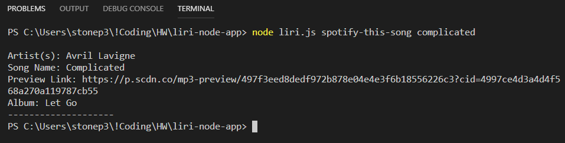

# LIRI Bot
LIRI is like iPhone's SIRI. However, while SIRI is a Speech Interpretation and Recognition Interface, LIRI is a Language Interpretation and Recognition Interface. LIRI will be a command line node app that takes in parameters and gives you back data.

## How it works?
LIRI can take in one of the following **commands** and the [user entry]:
-	**concert-this**  [U2]
-	**spotify-this-song** [complicated]
-	**movie-this** [avatar]
-	**do-what-it-says** [user entry is entered from a file]

## Commands execution samples

#### 1. node liri.js concert-this u2

#### 2. node liri.js spotify-this-song complicated

#### 3. node liri.js spotify-this-song (If there is no input from the user, it displays a default song information)

#### 4. node liri.js movie-this avatar

#### 5. node liri.js movie-this (If there is no input from the user, it displays a default movie information)

#### 6. node liri.js do-what-it-says

## Technology
This project was built with JavaScript, and Node.
